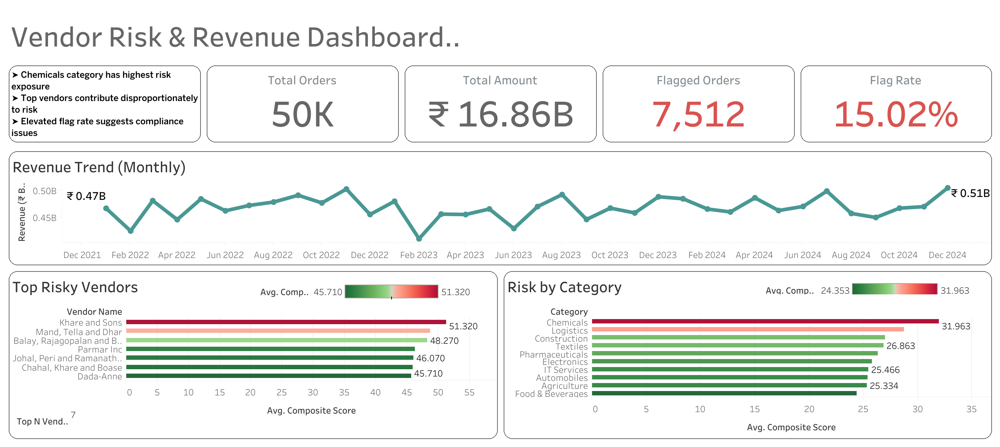

# GST Invoice Anomaly Detection & Vendor Risk Scoring System


An end-to-end analytics system that detects anomalous GST invoice patterns and scores vendor risk using a 3-layer detection pipeline built with Python, SQL, and PostgreSQL — visualized through an interactive Tableau dashboard.

---

## 🔍 Problem Statement

GST compliance fraud and invoice manipulation are growing concerns in Indian taxation. Manual auditing of large invoice datasets is time-consuming and error-prone.

This system automates anomaly detection across **50,000+ invoice records**, flags suspicious patterns, and prioritizes vendors for audit review using a **weighted risk scoring model**.

---

## 🏗️ System Architecture

Raw Data Simulation
↓
Layer 0 — Data Ingestion & PostgreSQL Storage
↓
Layer 1 — Rule-Based Validation
↓
Layer 2 — Statistical Anomaly Detection
↓
Layer 3 — Vendor Risk Scoring Model
↓
Tableau Dashboard (KPIs, Trends, Risk Analysis)


---

---

## 📊 Dashboard

🔗 [View Live Dashboard on Tableau Public](https://public.tableau.com/app/profile/kumar.saksham2703/viz/GST__/Dashboard1)



---

## 🔬 Detection Layers

### Layer 1 — Data Validation & Integrity Checks
- Duplicate invoice detection (same vendor + amount + date)
- GSTIN state code mismatch detection
- Invalid amount and missing field checks
- Output: every invoice tagged as `CLEAN` / `FLAGGED`

### Layer 2 — Statistical Anomaly Detection
- **Z-Score Analysis** — flags invoices deviating >2σ from vendor's own baseline using SQL window functions
- **Rolling Average Spike Detection** — flags invoices exceeding 3x the vendor's 6-month rolling average
- **IQR Outlier Detection** — flags invoices exceeding Q3 + 1.5×IQR at the category level

### Layer 3 — Vendor Risk Scoring Model
| Signal | Weight |
|---|---|
| Anomaly Frequency | 30% |
| Deviation Magnitude | 30% |
| Validation Failures | 20% |
| Recency Trend | 20% |

Vendors classified into **Low / Medium / High** risk tiers with audit priority queue.

---

## 📈 Key Results

| Metric | Value |
|---|---|
| Total Invoices Processed | 50,000 |
| Vendors Analyzed | 210 |
| Total Flagged Invoices | 7,512 (15%) |
| HIGH Risk Vendors | 35 |
| Flag Types Detected | 5 |

---

## 🛠️ Tech Stack

| Tool | Usage |
|---|---|
| Python | Data simulation, validation logic, scoring model |
| PostgreSQL | Normalized schema, data storage |
| SQL | Window functions, CTEs, rolling averages, IQR analysis |
| Pandas | Data export and transformation |
| Tableau Public | Interactive dashboard |

---

## 📁 Project Structure

```
gst-invoice-anomaly-detection/
├── schema.py                  # PostgreSQL table definitions
├── simulation.py              # Synthetic data generation (50K invoices)
├── layer1_validation.py       # Rule-based integrity checks
├── layer2_statistical.py      # Statistical anomaly detection
├── layer3_scoring.py          # Vendor risk scoring model
├── export.py                  # CSV export for Tableau
├── requirements.txt           # Python dependencies
├── tableau_exports/           # CSV files used in dashboard
└── README.md
```
---

## ⚙️ Setup & Run

```bash
# 1. Clone the repository
git clone https://github.com/Saksham3124/gst-invoice-anomaly-detection.git
cd gst-invoice-anomaly-detection

# 2. Create virtual environment
python -m venv gst_env
source gst_env/bin/activate  # Windows: gst_env\Scripts\activate

# 3. Install dependencies
pip install -r requirements.txt

# 4. Set up PostgreSQL
# Create database 'gst_analytics' in pgAdmin
# Run schema.py to create tables

# 5. Run pipeline in order
python simulation.py
python layer1_validation.py
python layer2_statistical.py
python layer3_scoring.py
python export.py
```

---

## 🔑 Key SQL Techniques Used

```sql
-- Vendor baseline deviation using window functions
AVG(amount) OVER (PARTITION BY vendor_id) AS baseline,
STDDEV(amount) OVER (PARTITION BY vendor_id) AS std_dev

-- Rolling average spike detection
AVG(amount) OVER (
    PARTITION BY vendor_id
    ORDER BY invoice_date
    ROWS BETWEEN 30 PRECEDING AND 1 PRECEDING
) AS rolling_avg

-- IQR outlier detection
PERCENTILE_CONT(0.75) WITHIN GROUP (ORDER BY amount) -
PERCENTILE_CONT(0.25) WITHIN GROUP (ORDER BY amount) AS iqr
```

---

## 👤 Author

**Kumar Saksham**
[LinkedIn](https://linkedin.com/in/kumarsaksham) |  [Tableau Public](https://public.tableau.com/app/profile/kumar.saksham2703)
