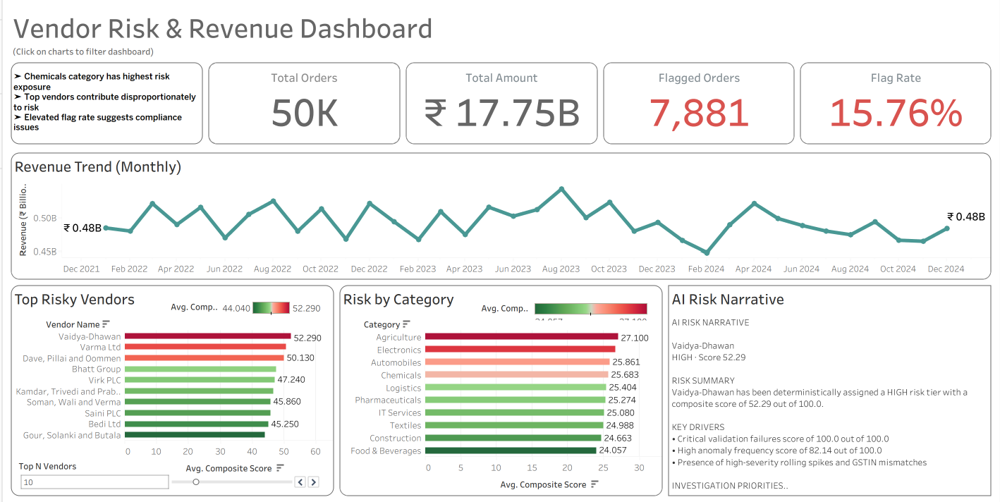

# GST Invoice Anomaly Detection & Vendor Risk Scoring System

[](https://www.python.org/)
[](https://www.postgresql.org/)
[](https://public.tableau.com/app/profile/kumar.saksham2703/viz/GST__/Dashboard1)
[](https://ai.google.dev/)
[](tests/)

An end-to-end GST invoice analytics system that validates transactional integrity, detects statistical anomalies, computes deterministic vendor risk scores, and generates AI-assisted risk narratives for audit investigation.

---

## 📈 Key Results

| Metric | Value | Description |
|---|---|---|
| **Total Invoices Processed** | `50,000` | Multi-year simulated transactional dataset (2022–2024) |
| **Vendors Analyzed** | `210` | Unique vendors across 10 major Indian states and industry sectors |
| **Flagged Invoices** | `7,512` | Total invoices triggering one or more validation or statistical rules |
| **Overall Flag Rate** | `15.02%` | Baseline anomaly proportion across the full invoice population |
| **HIGH Risk Vendors** | `35` | Vendors with composite risk score $\ge 35.0$ requiring priority audit |
| **Distinct Flag Types** | `5` | `DUPLICATE`, `GSTIN_MISMATCH`, `INVALID_AMOUNT`, `STATISTICAL_ZSCORE`, `ROLLING_SPIKE`, `IQR_OUTLIER` |
| **Total Discrepant Tax** | `₹2.38B` | Tax claimed on flagged invoices across all risk tiers |

---

## 📊 Dashboard

An interactive dashboard deployed on Tableau Public provides multi-level drill-downs from aggregate executive KPIs to category distributions and individual high-risk vendor profiles.

👉 **[View Live Interactive Dashboard on Tableau Public](https://public.tableau.com/app/profile/kumar.saksham2703/viz/GST__/Dashboard1)**



---

## 🏗️ Architecture Overview

The pipeline implements a strict 4-layer architecture ensuring that statistical anomaly detection and numerical risk scoring remain 100% deterministic and authoritative. Layer 4 acts exclusively as an explainable decision-support interface.

```text
Raw Data Simulation (simulation.py)
        ↓
Layer 0 — Relational Storage (PostgreSQL: vendors, invoices, gst_categories)
        ↓
Layer 1 — Rule-Based Validation (layer1_validation.py)
        ↓
Layer 2 — Statistical Anomaly Detection (layer2_statistical.py)
        ↓
Layer 3 — Deterministic Vendor Risk Scoring (layer3_scoring.py)
        ↓
Layer 4 — AI-Assisted Risk Narrative (ai_risk_narrative.py)
        ↓
Tableau Analytics & Audit Reporting (export.py → tableau_exports/)
```

- **Layers 1–3**: Perform deterministic rule validation, window-based outlier calculations, and mathematical composite scoring.
- **Layer 4**: Translates already-validated quantitative signals into structured, human-readable risk narratives.
- **Downstream**: Prepares denormalized CSV extracts tailored for Tableau dashboards and audit worklists.

---

## 🎯 Problem Statement

Goods and Services Tax (GST) ecosystems process millions of business-to-business (B2B) invoices monthly. Manual invoice-by-invoice audits are computationally infeasible, while simplistic rule checks miss subtle statistical patterns such as gradual baseline creep, rolling volume spikes, and category-level pricing deviations.

This project delivers an automated, scalable pipeline that:
1. Filters overt data integrity flaws (duplicates, state-code mismatches, negative tax).
2. Quantifies behavioral deviations using window functions and interquartile fencing.
3. Aggregates multi-dimensional signals into an authoritative, normalized vendor risk score.
4. Generates concise, evidence-grounded risk narratives via the Gemini API to streamline investigator triaging.

---

## 🔍 Layer Breakdown

### Layer 1 — Rule-Based Validation (`layer1_validation.py`)
Executes deterministic validation checks directly in PostgreSQL and marks invoices as `CLEAN` or `FLAGGED`:
- **Duplicate Detection**: Flags identical billing instances sharing `(vendor_id, amount, invoice_date)` (`DUPLICATE`, Medium severity).
- **GSTIN State-Code Validation**: Verifies that the outward supply `state_code` matches the 2-digit state prefix of the vendor's registered GSTIN (`GSTIN_MISMATCH`, High severity).
- **Amount & Tax Integrity**: Rejects non-positive invoice amounts ($\le 0$) and negative tax claims (`INVALID_AMOUNT`, High severity).
- **Completeness Checks**: Validates non-null constraints across critical fields (`invoice_id`, `vendor_id`, `invoice_date`, `amount`).

### Layer 2 — Statistical Anomaly Detection (`layer2_statistical.py`)
Applies statistical SQL window functions across validated `CLEAN` invoices to uncover subtle behavioral outliers:
- **Baseline Deviation (Z-Score)**:
  Computes historical vendor baseline ($\mu$) and standard deviation ($\sigma$). Flags transactions deviating $> 2\sigma$ (`STATISTICAL_ZSCORE`, Medium) and $> 3\sigma$ (High severity):
  $$\text{Z-Score} = \frac{\text{Amount} - \mu_{\text{vendor}}}{\sigma_{\text{vendor}}}$$
- **Rolling Average Spike Detection**:
  Calculates a trailing moving average over a **30-invoice window** (`ROWS BETWEEN 30 PRECEDING AND 1 PRECEDING`). Flags invoices exceeding $3\times$ their recent trailing baseline (`ROLLING_SPIKE`, High severity).
- **Category IQR Outlier Detection**:
  Calculates category-specific quartiles ($Q_1$, $Q_3$) using `PERCENTILE_CONT`. Identifies transactions exceeding the upper fence:
  $$\text{Upper Fence} = Q_3 + 1.5 \times (Q_3 - Q_1)$$
  Flagged as `IQR_OUTLIER` (Medium severity).

### Layer 3 — Deterministic Vendor Risk Scoring (`layer3_scoring.py`)
Computes four normalized signals ($0-100$ scale) for each vendor and generates an authoritative composite risk score:

| Signal | Weight | Metric Definition |
|---|---|---|
| **Anomaly Frequency** | `30%` | Flagged Invoices $\div$ Total Invoices ($\times 100$) |
| **Deviation Magnitude** | `30%` | Normalized average Z-score of statistical outliers |
| **Validation Failures** | `20%` | High-severity flags $\div$ Total Invoices ($\times 100$) |
| **Recency Trend** | `20%` | Ratio of recent flags (last 6 months) vs. historical flags |

$$\text{Composite Score} = 0.30 \times \text{Freq} + 0.30 \times \text{Mag} + 0.20 \times \text{Val} + 0.20 \times \text{Rec}$$

**Authoritative Risk Tiers**:
- 🔴 **HIGH**: Composite Score $\ge 35.0$ (35 vendors)
- 🟡 **MEDIUM**: Composite Score $\ge 20.0$ and $< 35.0$ (126 vendors)
- 🟢 **LOW**: Composite Score $< 20.0$ (49 vendors)

Scores are persisted to `vendor_risk_scores`. Layer 3 remains the final numerical authority.

### Layer 4 — AI-Assisted Risk Narrative (`ai_risk_narrative.py`)
Consumes already-validated evidence for high-risk vendors and calls the Google Gemini API (via the official `google-genai` SDK) to generate structured audit summaries:
- **Input Grounding**: Sends deterministic metrics (composite score, sub-scores, flag rate, and itemized flag type breakdown).
- **Structured Schema**: Validated via Pydantic model (`risk_summary`, `key_drivers`, `investigation_priorities`, `evidence`).
- **Target Selection**: Defaults to `AI_RISK_TIERS=HIGH`; supports multi-tier configuration (`HIGH,MEDIUM`).
- **Storage Isolation**: Persisted independently into `ai_risk_narratives`, preserving an immutable snapshot of the score and tier at time of generation.

---

## 🛡️ Critical AI Boundary & Governance

> [!IMPORTANT]
> **Gemini operates strictly as an explainable decision-support layer.**
>
> - **No Autonomous Decisions**: Gemini does NOT detect fraud, calculate anomaly scores, compute vendor risk scores, or assign risk tiers.
> - **No Classification Overrides**: The AI cannot alter, override, or adjust the deterministic `HIGH`, `MEDIUM`, or `LOW` classifications established by Layer 3.
> - **No Legal Accusations**: System instructions explicitly prohibit the model from asserting that a taxpayer committed fraud, tax evasion, or intentional illegality. Findings are framed strictly as anomalous patterns warranting audit verification.
> - **Grounded in Validated Evidence**: Narratives cite only facts, counts, and metrics explicitly provided in the payload. Speculative or hallucinated business activities are strictly constrained.

---

## 🛠️ Tech Stack

| Tool / Technology | Purpose |
|---|---|
| **Python 3.12** | Core data pipelines, statistical modeling, API orchestration, and test framework |
| **PostgreSQL 17** | Relational data warehouse, transactional schema, and relational integrity |
| **SQL** | Window functions (`AVG OVER`, `STDDEV OVER`), CTEs, rolling frames, and `PERCENTILE_CONT` |
| **Google Gemini API** | LLM inference (`gemini-2.5-flash`) via the official `google-genai` SDK |
| **Pydantic v2** | Strict schema validation and serialization of structured AI outputs |
| **Pandas & NumPy** | In-memory data transformation, metric aggregations, and CSV export generation |
| **Faker** | Generation of realistic Indian commercial vendor identities and GSTINs |
| **Tableau Public** | Interactive analytics dashboard and visual risk exploration |
| **Pytest** | Automated unit and integration testing suite with mocked LLM/DB interfaces |

---

## 🗄️ Database Schema

The relational schema ([schema.py](schema.py)) isolates transactional records, flags, deterministic scores, and AI explanations:

```sql
-- Master tables
CREATE TABLE vendors (...);
CREATE TABLE gst_categories (...);
CREATE TABLE invoices (...);

-- Anomaly flags generated by Layers 1 & 2
CREATE TABLE flags (
    flag_id     SERIAL PRIMARY KEY,
    invoice_id  VARCHAR(20) REFERENCES invoices(invoice_id),
    vendor_id   INT REFERENCES vendors(vendor_id),
    flag_type   VARCHAR(50) NOT NULL,
    severity    VARCHAR(10) NOT NULL,
    flag_date   TIMESTAMP DEFAULT CURRENT_TIMESTAMP,
    details     TEXT
);

-- Authoritative scores generated by Layer 3
CREATE TABLE vendor_risk_scores (
    vendor_id           INT REFERENCES vendors(vendor_id),
    anomaly_frequency   DECIMAL(5,2),
    deviation_magnitude DECIMAL(10,4),
    validation_failures DECIMAL(5,2),
    recency_score       DECIMAL(5,2),
    composite_score     DECIMAL(5,2),
    risk_tier           VARCHAR(10),
    scored_at           TIMESTAMP DEFAULT CURRENT_TIMESTAMP
);

-- Layer 4: AI Risk Narratives (isolated decision-support storage)
CREATE TABLE ai_risk_narratives (
    narrative_id             SERIAL PRIMARY KEY,
    vendor_id                INT REFERENCES vendors(vendor_id),
    risk_tier                VARCHAR(10) NOT NULL,
    composite_score          DECIMAL(5,2) NOT NULL,
    risk_summary             TEXT NOT NULL,
    key_drivers              TEXT[] NOT NULL,
    investigation_priorities TEXT[] NOT NULL,
    evidence                 TEXT[] NOT NULL,
    model_name               VARCHAR(50) NOT NULL,
    generated_at             TIMESTAMP DEFAULT CURRENT_TIMESTAMP
);
```

---

## 📊 Tableau Exports

Running `export.py` extracts 7 curated datasets into the `tableau_exports/` directory:

| Export File | Records | Primary Usage |
|---|---|---|
| `kpi_overview.csv` | 1 | Executive summary card metrics (total volume, gross tax, flag rate) |
| `flags_breakdown.csv` | 6 | Anomaly volume, severity distribution, and vendor counts by flag type |
| `monthly_trends.csv` | 36 | 3-year monthly time-series of invoice volume vs. flagged volume |
| `vendor_risk_scores.csv` | 210 | Deterministic composite scores, normalized sub-signals, and risk tiers |
| `invoice_detail.csv` | 50,000 | Invoice-level records with joined category rates and flag descriptions |
| `category_risk.csv` | 10 | Sector-level risk profiles, average invoice values, and discrepancy rates |
| `ai_risk_narratives.csv` | Dynamic | AI-generated risk summaries, key drivers, and prioritized audit steps |

---

## 📁 Project Structure

```text
gst-invoice-anomaly-detection/
├── schema.py                   # PostgreSQL DDL schema definition (Tables: Layers 0-4)
├── simulation.py               # Data generator (50,000 invoices + realistic anomalies)
├── layer1_validation.py        # Layer 1: Rule-based validation & GSTIN verification
├── layer2_statistical.py       # Layer 2: Statistical outliers (Z-Score, Rolling, IQR)
├── layer3_scoring.py           # Layer 3: Authoritative vendor risk scoring & tiering
├── ai_risk_narrative.py        # Layer 4: Gemini-powered structured risk narratives
├── export.py                   # Data export pipeline generating CSVs for Tableau
├── tests/
│   ├── __init__.py
│   └── test_ai_risk_narrative.py # Pytest test suite (11 unit tests)
├── tableau_exports/            # Exported CSV datasets consumed by Tableau
│   ├── category_risk.csv
│   ├── flags_breakdown.csv
│   ├── invoice_detail.csv
│   ├── kpi_overview.csv
│   ├── monthly_trends.csv
│   ├── vendor_risk_scores.csv
│   └── ai_risk_narratives.csv
├── dashboard.png               # High-resolution dashboard preview
├── dashboard.twbx              # Packaged Tableau workbook
├── requirements.txt            # Python package dependencies
├── .env.example                # Template for environment configuration
├── .gitignore                  # Git ignore rules (.env, venv, caches)
└── README.md                   # Project documentation
```

---

## ⚙️ Configuration & Environment Variables

All credentials and runtime settings are loaded through environment variables.

### 1. Initialize Local Environment File
Copy `.env.example` to create your untracked `.env` file:

```bash
cp .env.example .env
```

### 2. Configure Settings
Populate `.env` with your local credentials:

```env
# Gemini API Configuration
GEMINI_API_KEY=your_actual_gemini_api_key_here
GEMINI_MODEL=gemini-2.5-flash
AI_RISK_TIERS=HIGH

# PostgreSQL Database Configuration
DB_HOST=localhost
DB_PORT=5432
DB_NAME=gst_analytics
DB_USER=postgres
DB_PASSWORD=your_database_password
```

| Variable | Default | Purpose |
|---|---|---|
| `GEMINI_API_KEY` | *(Required for Layer 4)* | Google Gemini API key. Never committed to version control. |
| `GEMINI_MODEL` | `gemini-2.5-flash` | Gemini model variant used for structured narrative generation. |
| `AI_RISK_TIERS` | `HIGH` | Target tiers for Layer 4 (`HIGH` or `HIGH,MEDIUM`). |
| `DB_HOST` | `localhost` | PostgreSQL host address. |
| `DB_PORT` | `5432` | PostgreSQL listening port. |
| `DB_NAME` | `gst_analytics` | PostgreSQL database name. |
| `DB_USER` | `postgres` | Database username. |
| `DB_PASSWORD` | *(None)* | Database password. |

---

## 🚀 Setup & Pipeline Execution

### Prerequisites
- Python 3.12+
- PostgreSQL 14+
- Tableau Desktop or Tableau Public (to inspect `.twbx`)

### 1. Clone & Set Up Virtual Environment

```bash
git clone https://github.com/Saksham3124/gst-invoice-anomaly-detection.git
cd gst-invoice-anomaly-detection

# Create and activate virtual environment
python -m venv gst_env

# Windows:
gst_env\Scripts\activate

# macOS / Linux:
source gst_env/bin/activate

# Install dependencies
pip install -r requirements.txt
```

### 2. Configure Database & Environment
1. Create a PostgreSQL database named `gst_analytics`.
2. Configure `.env` with your database credentials and `GEMINI_API_KEY`.
3. Execute table creation:
   ```bash
   python -c "import psycopg2, os; from dotenv import load_dotenv; from schema import schema_sql; load_dotenv(); conn = psycopg2.connect(dbname=os.getenv('DB_NAME'), user=os.getenv('DB_USER'), password=os.getenv('DB_PASSWORD'), host=os.getenv('DB_HOST'), port=os.getenv('DB_PORT')); cur = conn.cursor(); cur.execute(schema_sql); conn.commit(); conn.close(); print('Schema created successfully.')"
   ```

### 3. Run Pipeline Sequentially

```bash
# Step 1: Simulate master vendors and 50,000 invoices with injected anomalies
python simulation.py

# Step 2: Run Layer 1 deterministic validation (duplicates, state mismatches)
python layer1_validation.py

# Step 3: Run Layer 2 statistical anomaly detection (Z-scores, rolling spikes, IQR)
python layer2_statistical.py

# Step 4: Run Layer 3 deterministic vendor risk scoring (composite index & tiers)
python layer3_scoring.py

# Step 5: Run Layer 4 Gemini AI risk narrative generation (Optional)
python ai_risk_narrative.py

# Step 6: Export all processed datasets for Tableau
python export.py
```

---

## 🧪 Automated Testing

The automated test suite verifies prompt construction, tier filtering, schema validation, non-blocking resilience, score immutability, and credential redaction using mocked Gemini and PostgreSQL clients.

Execute tests using pytest:

```bash
pytest -v
```

### Verified Test Results (11 Passed, 0 Failed)

```text
tests/test_ai_risk_narrative.py::test_valid_gemini_structured_response PASSED     [  9%]
tests/test_ai_risk_narrative.py::test_missing_api_key PASSED                     [ 18%]
tests/test_ai_risk_narrative.py::test_gemini_api_failure PASSED                  [ 27%]
tests/test_ai_risk_narrative.py::test_malformed_json_response PASSED             [ 36%]
tests/test_ai_risk_narrative.py::test_schema_validation_failure PASSED           [ 45%]
tests/test_ai_risk_narrative.py::test_high_only_filtering PASSED                 [ 54%]
tests/test_ai_risk_narrative.py::test_db_fetch_filters_high_only PASSED          [ 63%]
tests/test_ai_risk_narrative.py::test_high_and_medium_filtering PASSED           [ 72%]
tests/test_ai_risk_narrative.py::test_deterministic_risk_score_remains_unchanged PASSED [ 81%]
tests/test_ai_risk_narrative.py::test_ai_narrative_stored_separately PASSED         [ 90%]
tests/test_ai_risk_narrative.py::test_no_secret_exposed_in_logs PASSED           [100%]

============================= 11 passed in 5.63s ==============================
```

---

## ⚡ Failure Behavior & System Resilience

Layer 4 is architected with strict resilience guarantees to prevent downstream reporting interruptions:

- **Missing API Key**: If `GEMINI_API_KEY` is not configured, Layer 4 gracefully logs a warning and exits cleanly. Upstream Layers 1–3 and existing exports remain 100% operational.
- **API Availability & Rate Limits**: Transient HTTP errors, timeouts, or 429 rate limits are trapped per-vendor. The system logs the failure and proceeds to the next vendor.
- **Malformed LLM Output**: Non-JSON responses or outputs violating the Pydantic schema are discarded rather than contaminating the database.
- **Database Resilience**: Write errors during narrative insertion do not touch or roll back `vendor_risk_scores`.
- **Log Sanitization**: All error logging passes through `sanitize_log_message(...)`, redacting API keys, passwords, and tokens before terminal output.

---

## 💡 Key SQL Techniques

### 1. Vendor Baseline Deviation (Z-Score)
```sql
WITH vendor_stats AS (
    SELECT
        vendor_id,
        AVG(amount)    OVER (PARTITION BY vendor_id) AS baseline,
        STDDEV(amount) OVER (PARTITION BY vendor_id) AS std_dev,
        amount,
        invoice_id
    FROM invoices
    WHERE validation_status = 'CLEAN'
)
SELECT invoice_id, vendor_id, amount, baseline, std_dev,
       (amount - baseline) / NULLIF(std_dev, 0) AS z_score
FROM vendor_stats
WHERE (amount - baseline) / NULLIF(std_dev, 0) > 2
ORDER BY z_score DESC;
```

### 2. Trailing 30-Invoice Rolling Average
```sql
SELECT
    invoice_id,
    vendor_id,
    amount,
    invoice_date,
    AVG(amount) OVER (
        PARTITION BY vendor_id
        ORDER BY invoice_date
        ROWS BETWEEN 30 PRECEDING AND 1 PRECEDING
    ) AS rolling_avg
FROM invoices
WHERE validation_status = 'CLEAN';
```

### 3. Category-Level Interquartile Range (IQR) Fencing
```sql
WITH category_iqr AS (
    SELECT
        category_id,
        PERCENTILE_CONT(0.25) WITHIN GROUP (ORDER BY amount) AS q1,
        PERCENTILE_CONT(0.75) WITHIN GROUP (ORDER BY amount) AS q3
    FROM invoices
    WHERE validation_status = 'CLEAN'
    GROUP BY category_id
)
SELECT i.invoice_id, i.vendor_id, i.amount,
       c.q3 + 1.5 * (c.q3 - c.q1) AS upper_fence
FROM invoices i
JOIN category_iqr c ON i.category_id = c.category_id
WHERE i.validation_status = 'CLEAN'
  AND i.amount > (c.q3 + 1.5 * (c.q3 - c.q1));
```

---

## 🔒 Security Best Practices

- **Zero Hardcoded Secrets**: All database connection parameters and API keys are loaded via `python-dotenv`.
- **Git Hygiene**: `.env` and `.env.*` are excluded via `.gitignore`; `.env.example` provides non-sensitive template defaults.
- **Credential Masking**: Regex sanitizers scrub sensitive strings from application logs and console outputs.
- **Git History Notice**: Hardcoded credentials committed in historical repository revisions (`cfc3de2...`) were eliminated from all current source files and must be purged with history-cleaning tools before public mirroring.

---

## 👤 Author

**Kumar Saksham**

- **GitHub**: [@Saksham3124](https://github.com/Saksham3124)
- **LinkedIn**: [Kumar Saksham](https://www.linkedin.com/in/kumar-saksham-94b150257/)
- **Tableau Public**: [Kumar Saksham Profile](https://public.tableau.com/app/profile/kumar.saksham2703/viz/GST__/Dashboard1)
- **Repository**: [gst-invoice-anomaly-detection](https://github.com/Saksham3124/gst-invoice-anomaly-detection)
